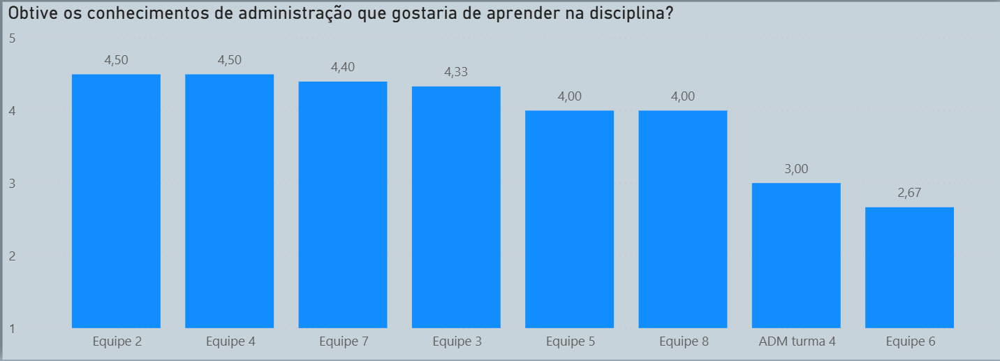
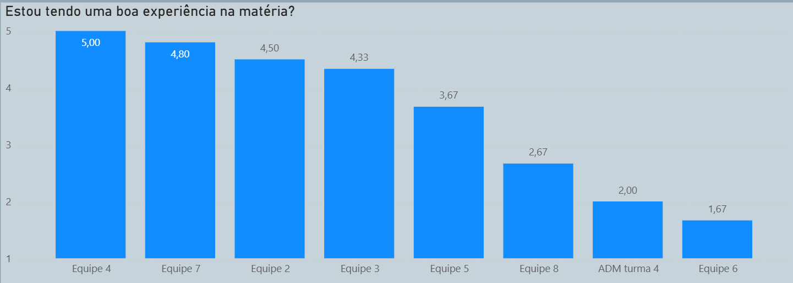
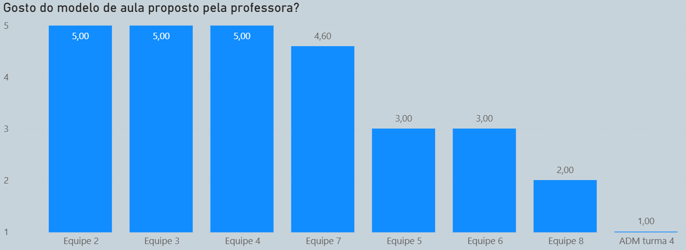
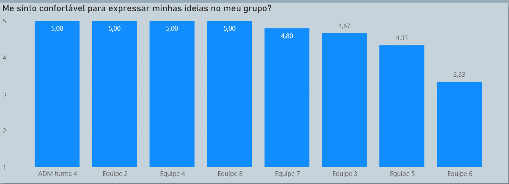
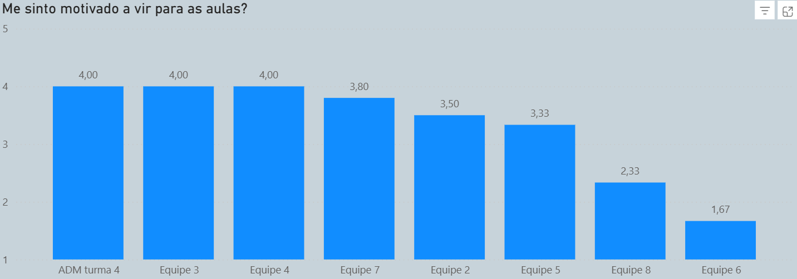
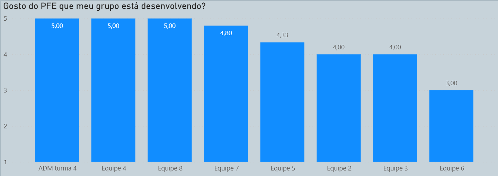
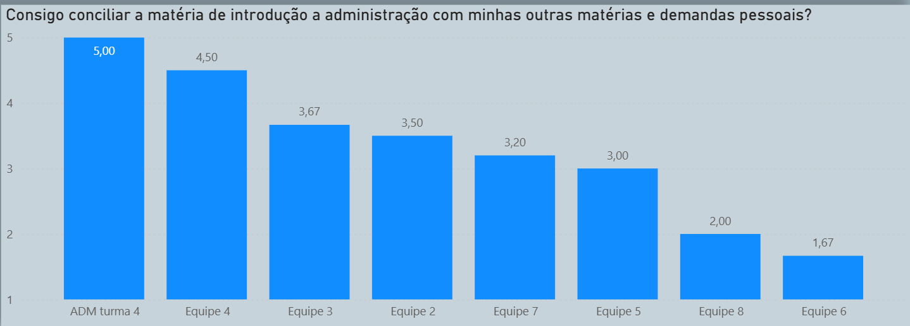

---
# Nome do arquivo PDF gerado na pasta resultado
output-file: "Nome do alocado - análise 3 e 4"
---

```{r setup}
source("rdocs/consultor2.R")
```


```{r}
# Rodar apenas uma vez na vida!
## Instalando o tinytex(pacote apenas)
### CRAN version
install.packages('tinytex')


## Baixando o tinytex
library(tinytex)
tinytex::install_tinytex()
```


{fig-align="center"}

Ao analisar as respostas da pergunta "Obtive os conhecimentos de administração que gostaria de aprender na disciplina?". As respostas foram em maioria satisfatórias. Com 6 grupos obtendo média 4 ou mais, um grupo média 3 e apenas um grupo com média menor que 3,  que foi a equipe 6 com 2,67. 

{fig-align="center"}

Ao serem perguntados sobre estarem tendo uma boa experiência na matéria, todos os respondentes do grupo 4 deram nota 5 (concordo totalmente), nos grupos 2, 3, 5 e 7 a média também foi maior que 4. A equipe 5 apresentou um comportamento mais próximo do neutro, com média 3,67 e as 3 demais equipes não tiveram uma experiência muito satisfatórias, com médias que variaram entre 1,67 e 2,67.

{fig-align="center"}

Em relação à percepção sobre o modelo de aula proposto pela professora, nota-se uma grande divisão entre os grupos. Três equipes (Equipe 2, Equipe 3 e Equipe 4) alcançaram a pontuação máxima com média 5 (concordo totalmente), seguidas pela Equipe 7 com uma média bastante satisfatória de 4,60. As equipes 5 e 6 apresentaram uma postura neutra em relação à didática, ambas com média 3,00. Por fim, os respondentes da Equipe 8 e o aluno identificado como "ADM turma 4" apresentaram insatisfação, com médias 2 e 1 respectivamente.

{fig-align="center"}

Ao avaliar o nível de conforto dos alunos para expressar ideias dentro de suas próprias equipes, os resultados gerais foram bem positivos. As equipes 2, 4, 8 e o aluno identificado como "ADM turma 4" atingiram nota máxima e as equipes 7, 3 e 5 também apresentaram excelente relação de escuta com os colegas de equipe, tendo médias 4,80, 4,67 e 4,33, respectivamente. A única equipe que apresentou um comportamento um pouco mais neutro, embora levemente positivo, foi a Equipe 6, que fechou com a menor média do gráfico (3,33).

{fig-align="center"}

No que diz respeito à motivação para frequentar as aulas, três grupos apresentaram média 4 ("ADM turma 4", Equipe 3 e Equipe 4). As equipes 2, 5 e 7 ficaram entre 3,33 e 3,8. As equipes com menor motivação para irem para as aulas foram a 8 e a 6, com médias 2,33 e 1,67, respectivamente. 

{fig-align="center

A satisfação em relação ao PFE desenvolvido pela equipe se mostrou bastante elevada na maioria dos casos. Três grupos atingiram o nível máximo de satisfação com média 5 ("ADM turma 4", Equipe 4 e Equipe 8). Ainda com alta satisfação, as equipes 7 e 5, registraram médias de 4,80 e 4,33, respectivamente. As equipes 2 e 3 tiveram média 4 (concordo), já a equipe 6, é a única que se mostrou neutra em relação a satisfação com o projeto, apresentando média 3.

{fig-align="center"}

A capacidade de conciliação da disciplina com a rotina pessoal e acadêmica apresentou uma variação acentuada entre os respondentes. O aluno identificado como "ADM turma 4" não teve problemas na conciliação e concordou totalmente com a afirmação de que consegue conciliar a matéria com o restante de suas demandas pessoais e acadêmicas, a equipe 4 também apresentou conciliação satisfatória, com média 4,50. As médias das equipes 2, 3, 5 e 7 variaram entre 3 e 3,67, já as equipes 8 e 6 aforam as que apresentaram maior dificuldade de conciliação, com médias 2 e 1,67 respectivamente.

{fig-align="center"}

No que diz respeito ao bem-estar e entrosamento dos alunos dentro de seus respectivos grupos, os índices foram majoritariamente excelentes. Quatro das oito equipes avaliadas ("ADM turma 4", Equipe 2, Equipe 4 e Equipe 8) registraram a pontuação máxima de 5,00, indicando um ambiente interno muito saudável. Esse clima positivo também foi fortemente observado nas equipes 7 e 3, que tiveram médias de 4,8 e 4,33 respectivamente. A Equipe 5 apresentou um comportamento mais próximo do neutro, com média 3,67, enquanto a Equipe 6 se destacou negativamente como o único grupo com uma vivência interna insatisfatória, registrando uma média de 2,00.
