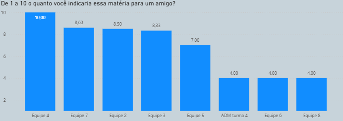
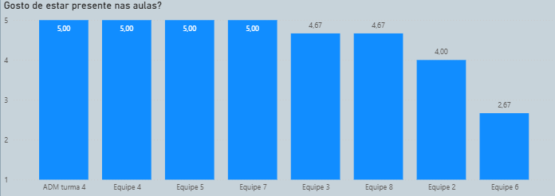
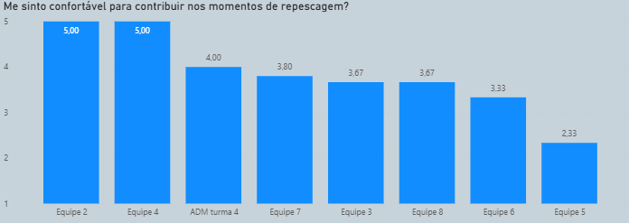
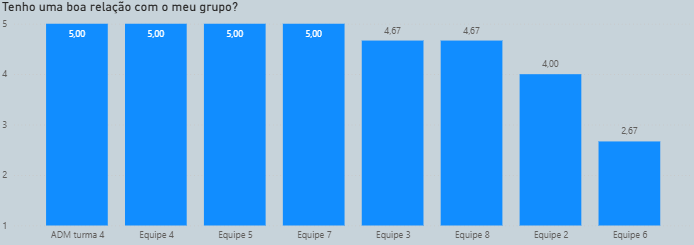
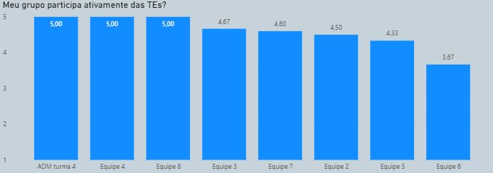
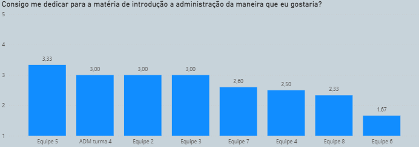
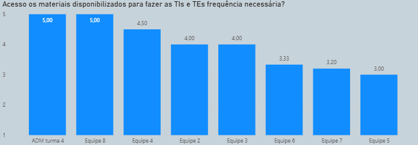
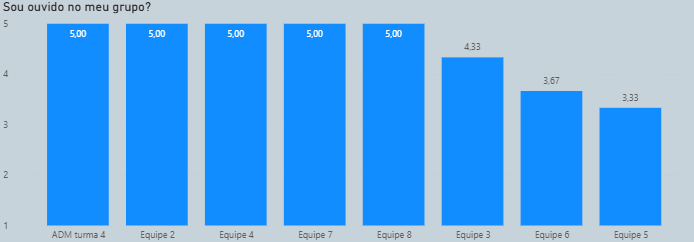

```{r}
#| include: false

```

# Introdução

O seguinte relatório tem como objetivo analisar o engajamento dos alunos com a matéria de iADM, mais especificamente a turma 4, a fim de analisar algumas métricas que mostram satisfação; comprometimento com as atividades ministradas em sala de aula e planejadas seguindo o Plano de Ensino.

Dessa maneira, a base de dados foi confeccionada utilizando um questionário de autoria dap rópria Equipe 7 com perguntas se baseando em materiais direcionados pela professora. Com isso, os alunos poderam responder de maneira anônima as perguntas presentes no formulário, seguindo as orientações presentes.

Apesar disso, um pouco mais de 50% da turma respondeu ao formulário, perdendo um pouco riqueza proposta pelo grupo devido a falta de engajamento com o questionário. Aliado a isso, há um aluno que ao falar sobre a equipe que estava presente, respondeu que fazia parte de "iADM Turma 4", não podendo ser questionado pois não há nenhuma identificação fornecida pelo(a) respondente.

Por fim, as análises foram confeccionadas utilizando o software estatístico gratuito R, ambientado em sua versão Rstudio, na versão 4.4.2. Nele é possível tratar dados, confeccionar gráficos e este relatório.

# Referencial Teórico

MARTINS, Maria do Carmo Fernandes et al. Construção e validação de uma escala de medida de clima organizacional. Revista Psicologia: Organizações e Trabalho (RPOT), Florianópolis, v. 4, n. 1, p. 37-60, jan./jun. 2004.

SÓLIDES. Pesquisa de engajamento: o que é, importância e como fazer. Sólides Blog, [s.d.]. Disponível em: https://solides.com.br/blog/pesquisa-de-engajamento/.

ESTAT CONSULTORIA. Pesquisa de Clima Organizacional 2026. Brasília: ESTAT Consultoria, 2026. Relatório interno não publicado.

# Análises

## Análise do NPS

A seguinte análise tem como objetivo analisar o indicador de sucesso da matéria de iADM sobre a perspectiva de indicar para um amigo. Dessa maneira foi utilizado uma escala de 1 até 10 em que 1 representa a mais negativa e 10 a mais positiva.

{fig-align="center"}
Observando o gráfico acima nota-se que somente a equipe 4 apresentou uma nota 10 de média, seguindo pelas equipes 7, 2 e 3 com notas acima de 8 em média.

Por outro lado, o aluno que não identificou a equipe, equipe 6 e 8 obtiveram um indicador com nota 4 em média.

## Análise da Satisfação em sala

A fim de verificar o quanto cada aluno das equipes em iADM gostam de estar presentes em sala, a seguinte pergunta foi realizada utilizando a escala Likert de 1 a 5, com 1 representando a mais negativa e 5 a mais positiva.

{fig-align="center"}
Observa-se pela figura que grande parte das equipes que responderam ao questionário apresentaram o valor máximo de 5, com as demais apresentando valores maiores ou iguais a 4. Entretanto, esse caso não foi repetido na equipe 6, com valor abaixo em média da nota 3.

## Análise do conforto em contribuir nas aulas

A fim de verificar o quanto cada aluno das equipes em iADM se sentem confortáveis em contribuir durante os momentos de repescagem realizados em sala de aula, a seguinte pergunta foi realizada utilizando a escala Likert de 1 a 5, com 1 representando a mais negativa e 5 a mais positiva.

{fig-align="center"}

Nota-se que ambas equipes 2 e 4 apresentaram nota máxima, com o aluno que não apresentou a equipe com nota 4.

Além disso, grande parte dos estudantes apresentaram nota entre a nota neutra, com valores um pouco maiores, entre 3,80 e 3,33 de média nas equipes 7, 3, 8 e 6.

Somente a equipe 5 apresentou uma nota baixa de somente 2,33.

## Análise dos relacionamentos intragrupos

A fim de verificar o quanto cada aluno das equipes em iADM apresentam uma boa relação com os grupos confeccionados no início do primeiro semestre de 2026, a seguinte pergunta foi realizada utilizando a escala Likert de 1 a 5, com 1 representando a mais negativa e 5 a mais positiva.

{fig-align="center"}

De maneira semelhante à pergunta sobre participação em sala, a grande maioria dos alunos apresentaram notas consideradas bastante satisfatórias com as equipes 4, 5, 7 e o aluno não identificado com nota máxima.

Ademais, as equipes 3, 8 e 2 apresentaram notas boas com valores pelo menos igualando 4, com exceção da equipe 6 com nota abiaxo da nota 3.


## Análise da participação das TEs

A fim de verificar o quanto cada aluno das equipes em iADM gostam de participar ativamente das TEs, a seguinte pergunta foi realizada utilizando a escala Likert de 1 a 5, com 1 representando a mais negativa e 5 a mais positiva.

{fig-align="center"}

Olhando a figura acima, 3 grupos apresentaram nota máxima, as equipes 4, 8 e o aluno não identificado. Apesar de não possuírem notas máximas, ainda as outras equipes estivarem notas acima ou próximas de 4, com notas médias consideradas satisfatórias.


## Análise da dedicação em iADM

A fim de verificar o quanto cada aluno das equipes em iADM conseguem se dedicar para a matéria de uma maneira considerada satisfatória, a seguinte pergunta foi realizada utilizando a escala Likert de 1 a 5, com 1 representando a mais negativa e 5 a mais positiva.

{fig-align="center"}

Analisando o gráfico acima, as notas não conseguiram apresentar valores considerados bons com uma nota média máxima da equipe 5 de somente 3,33.

Aliado a isso, a equipe 6 apresentou o menor número de insatisfação em relação a dedicação pessoal com a matéria de somente 1,67.


## Análise do acesso aos materiais disponibilizados

A fim de verificar o quanto cada aluno das equipes em iADM conseguem acessar aos materiais fornecidos para realizar as TIs e TEs, a seguinte pergunta foi realizada utilizando a escala Likert de 1 a 5, com 1 representando a mais negativa e 5 a mais positiva.

{fig-align="center"}

Nota-se que as opiniões ficarm mistas em média, com o aluno desconhecido e a equipe 8 com notas máximas, equipes 4,2 3 com valores maiores ou iguais a 4.

Em contrapartida, as equipes 6, 7 e 5 obtiveram valores considerados neutros em relação ao acesso dos materiais.


## Análise do quão ouvido a pessoa é nos grupos

A fim de verificar o quanto cada aluno das equipes em iADM são ouvidos pelos outros integrantes dos grupos, a seguinte pergunta foi realizada utilizando a escala Likert de 1 a 5, com 1 representando a mais negativa e 5 a mais positiva.

{fig-align="center"}

Somente as equipes 5 (3,33), 6 (3,67) e 3 (4,33) apresentaram notas diferentes da máxima, com todos os demais marcando em média que conseguem ser ouvidos pelos integrantes do grupo de maneira bastante satisfatória.

# Conclusões

Como pode ser observado, os alunos apresentaram valores bastante individuais com base em cada uma das equipes, mostrando como cada um consegue aproveitar a matéria de maneiras diferentes.

Esse comportamento pode ser bastante explicado e enfatizado pela Escola Comportamental de pensamento de Adminstração, esta que tem como foco o próprio trabalhador (que nesse estudo são representados pelos estudantes) de modo que possa ser analisado aspectos mais individuais e humanos de cada um.
